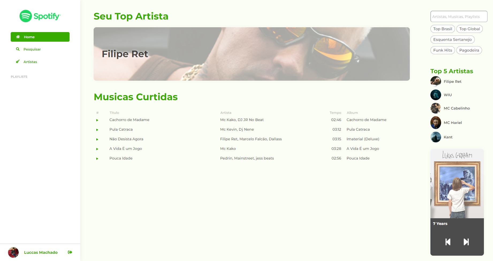

## Executar a aplicação.
Para executar a aplicação, execute o seguinte comando no terminal:
```sh
npm start
```

## Ferramentas para o tutorial:
```sh
npm i @angular/cli -g
```

## Resultado final:

